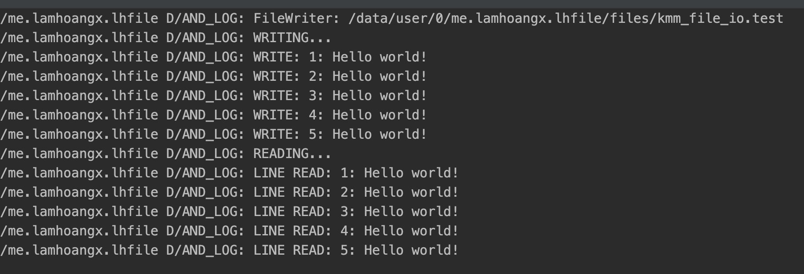
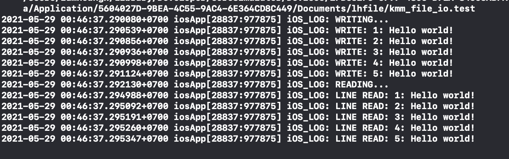

## LHFile
Support for file handing in Kotlin multiplatform
##
File I/O handing for KMM
### LHFile
```kotlin
expect class LHFile(path: String) {
    constructor(directory: String, fileName: String)
    val isDirectory: Boolean
    fun exists(): Boolean
    fun delete(): Boolean
    fun mkdirs()
    fun createNewFile()
}
```
## Utils
### Reader
```kotlin
expect class LHFileReader (path: String) {
    constructor(directory: String, fileName: String)
    fun isReady(): Boolean
    fun close()
    fun readLine(): String?
    fun getFilePointer(): Long
    fun seek(offset: Long)
}
```
### Writer
```kotlin
expect class LHFileWriter (path: String) {
    constructor(directory: String, fileName: String)
    fun isReady(): Boolean
    fun close()
    fun write(data: String)
    fun writeBreakLine()
}
```
## Test
```kotlin
// LHFileTest.kt
fun write(data: String) {
        val writer = LHFileWriter(path = pathFile)
        writer?.apply {
            if(isReady()) {
                LHTimber.d("WRITING...")
                for (i in 1..5) {
                    writer?.write("$i: $data")
                    writeBreakLine()
                }
            }
        }
        writer?.close()
    }

    fun read() {
        val reader = LHFileReader(pathFile)
        reader?.apply {
            if(isReady()) {
                var line: String? = null
                LHTimber.d("READING...")
                while (readLine()?.also { line = it } != null) {
                    line?.let {
                        LHTimber.d("LINE READ: $line")
                    }
                }
            }
        }
    }
```
Platform
```kotlin
// Android
val pathFile = "${baseContext.filesDir.absolutePath}/kmm_file_io.test"
val lhFile = LHFileTest(pathFile)
lhFile.apply {
    write("Hello world!")
    read()
}
```
```swift
// iOS
let pathDir = FileManager.default.urls(
    for: .documentDirectory,
    in: .userDomainMask
)[0].appendingPathComponent("lhfile")

let lhFile = LHFileTest(pathFile: "\(pathDir.path)/kmm_file_io.test")
lhFile.write(data: "Hello world!")
lhFile.read()
```
### output
[]()
<br>
[]()

##
Happy coding __